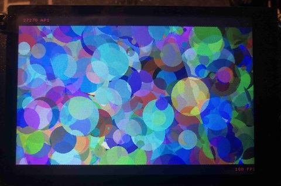
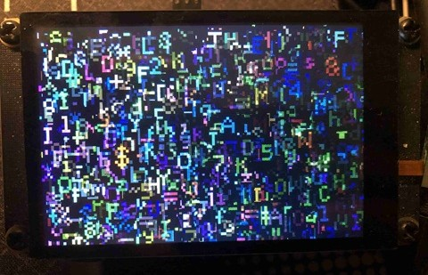

# Pico DM QD3503728 HAGL GFX

HAGL speed tests for Pico_DM_QD3503728 Display ext. board





## Requirements

- pico-sdk >= 2.1.1
- picotool >= 2.1.1

## How to build

### 1. Clone and initialize the repository
```bash
git clone https://github.com/embeddedboys/pico_dm_qd3503728_hagl_gfx.git
cd pico_dm_qd3503728_hagl_gfx

git submodule update --init
```

### 2. Build for Raspberry Pi Pico (RP2040)
```bash
mkdir build && cd build
cmake .. -G Ninja
ninja
```

### 3. Build for Raspberry Pi Pico 2 (RP2350 ARM core)
```bash
mkdir build-pico2 && cd build-pico2
cmake -DPICO_BOARD=pico2 .. -G Ninja
ninja
```

## Flash the target

Flash the target using picotool:
```bash
sudo picotool -fuvx pico_dm_qd3503728_hagl_gfx.uf2
```

Or you can using openocd by running under the build directory:
```bash
ninja flash
```
